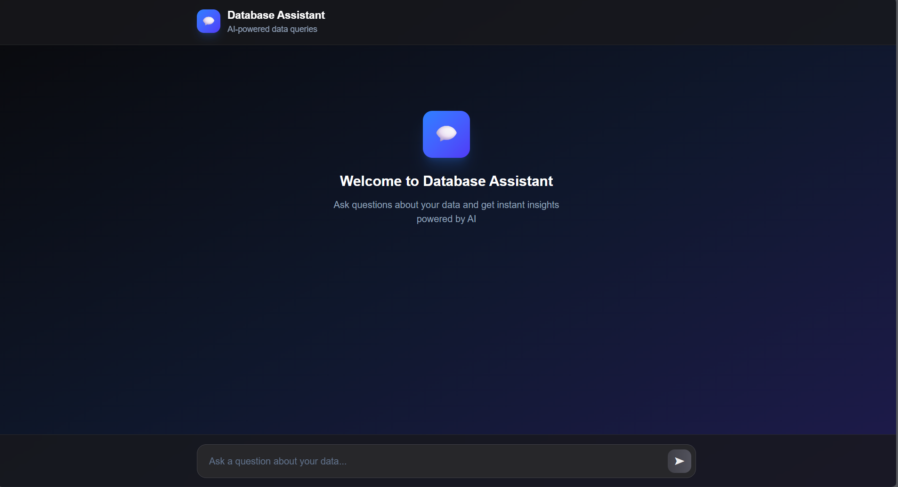

# SQL AI Agent (Next.js + Vercel AI SDK + Drizzle + Turso)

[](https://www.linkedin.com/in/jinaypatel1634)

An AI-powered database assistant that converts natural language into safe SQL SELECT queries and streams results to the UI.



## Tech Stack

- **Framework**: Next.js 16 (`app/` router)
- **UI**: React 19, Tailwind CSS 4
- **AI**: Vercel AI SDK (`ai`, `@ai-sdk/react`), OpenAI (`@ai-sdk/openai` using `gpt-4o`)
- **Database**: Turso (libSQL) with Drizzle ORM (`drizzle-orm`, `drizzle-kit`)

## Features

- **Natural language to SQL** using OpenAI via Vercel AI SDK
- **Safety guardrails**: only SELECT queries are allowed
- **Streaming responses** to the chat UI
- **Schema-aware** tool calling with a dedicated schema tool
- **Typed schema** via Drizzle for `products` and `sales`

## Notes

- Only SELECT queries are permitted by design in the system prompt.
- Tailwind CSS 4 is configured via PostCSS config.

## Project Structure

- `src/app/page.tsx` — chat UI using `useChat()`
- `src/app/api/chat/route.ts` — API route integrating OpenAI and DB/schema tools
- `src/db/schema.ts` — Drizzle schema (`products`, `sales`)
- `src/db/db.ts` — libSQL client + Drizzle instance
- `drizzle.config.ts` — Drizzle Kit config (Turso credentials)
- `Images/image.png` — screenshot used above

## Getting Started

1. **Install dependencies**

```bash
npm install
```

2. **Configure environment** — create `.env.local` in the project root with:

```bash
OPENAI_API_KEY=your_openai_api_key
TURSO_DATABASE_URL=libsql://your-db-url
TURSO_AUTH_TOKEN=your_turso_auth_token
```

3. **Generate and run migrations**

```bash
npm run db:generate
npm run db:migrate
```

4. **Start the dev server**

```bash
npm run dev
```

Open http://localhost:3000 and start chatting with your data.

## Environment Variables

- `OPENAI_API_KEY` — required by `@ai-sdk/openai` in `src/app/api/chat/route.ts`
- `TURSO_DATABASE_URL` — database URL used in `src/db/db.ts` and `drizzle.config.ts`
- `TURSO_AUTH_TOKEN` — auth token for Turso (if required for your DB)

## Database

- Schema is defined in `src/db/schema.ts` for two tables:
  - `products(id, name, category, price, stock, created_at)`
  - `sales(id, product_id, quantity, total_amount, sale_date, customer_name, region)`
- Drizzle Kit is configured in `drizzle.config.ts` (dialect: `turso`).
- Explore/inspect data using Drizzle Studio:

```bash
npm run db:studio
```

## Available Scripts

- `npm run dev` — start Next.js dev server
- `npm run build` — build for production
- `npm run start` — run production server
- `npm run lint` — run ESLint
- `npm run db:generate` — generate migrations from schema
- `npm run db:migrate` — apply migrations
- `npm run db:studio` — launch Drizzle Studio

## Usage

- Ask questions in plain English, e.g. "Top 5 products by revenue last month".
- The API (`src/app/api/chat/route.ts`) uses two tools:
  - **schema** tool returns the SQL DDL of current tables
  - **db** tool executes the generated SELECT query via `db.run()`
- The UI in `src/app/page.tsx` renders streamed messages and structured tool outputs.

